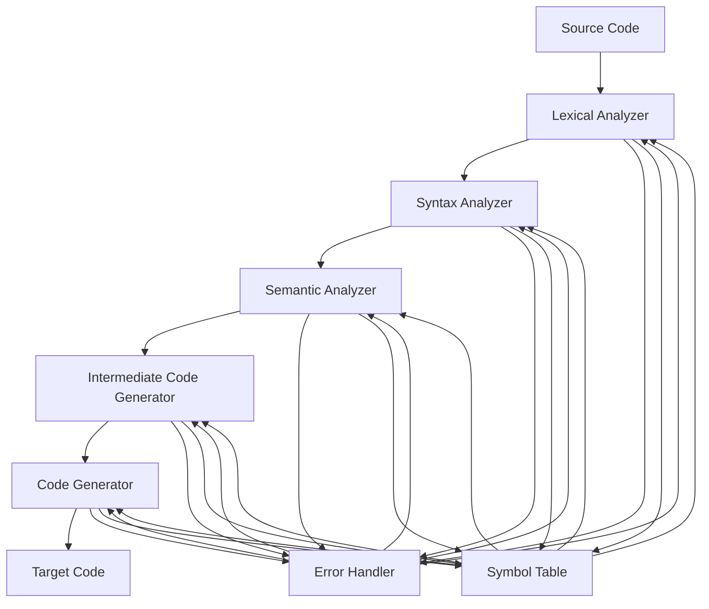

```mermaid
graph TD
    A["Source Code"] --> B["Lexical Analyzer"]
    B --> C["Syntax Analyzer"]
    C --> D["Semantic Analyzer"]
    D --> E["Intermediate Code Generator"]
    E --> F["Code Generator"]
    F --> G["Target Code"]

    B --> I["Error Handler"]
    C --> I
    D --> I
    E --> I
    F --> I

    B --> H["Symbol Table"]
    C --> H
    D --> H
    E --> H
    F --> H

    H --> B
    H --> C
    H --> D
    H --> E
    H --> F

    I --> B
    I --> C
    I --> D
    I --> E
    I --> F

```
