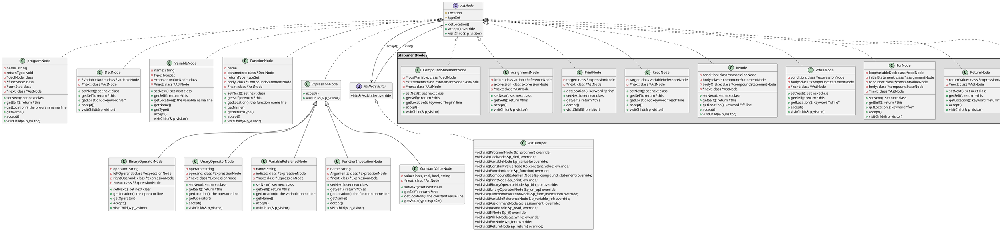

```plantuml

@startuml


interface AstNode {
    #Location
    #typeSet 
    +getLocation()
    +accept() override
    +visitChild(& p_visitor)
}

class programNode implements AstNode{
    -name: string
    -returnType: void
    - *declNode: class
    - *funcNode: class
    - *comStat: class
    - *next: class *AstNode
    +setNext(): set next class
    +getSelf(): return *this
    +getLocation(): the program name line
    +getName()
    +accept()
    +visitChild(& p_visitor)
}

class DeclNode implements AstNode {
    -*VariableNode: class *variableNode
    - *next: class *AstNode
    +setNext(): set next class
    +getSelf(): return *this
    +getLocation(): keyword 'var'
    +accept()
    +visitChild(& p_visitor)
}

class VariableNode implements AstNode{
    -name: string
    -type: typeSet
    -*constantValueNode: class
    - *next: class *AstNode
    +setNext(): set next class
    +getSelf(): return *this
    +getLocation(): the variable name line
    +getName()
    +getType()
    accept()
    visitChild(& p_visitor)
}


class FunctionNode implements AstNode{
    -name
    -parameters: class *DeclNode
    -returnType: typeSet
    -body: class *CompoundStatementNode
    - *next: class *AstNode
    +setNext(): set next class
    +getSelf(): return *this
    +getLocation(): the function name line
    +getName()
    +getReturnType()
    +accept()
    +visitChild(& p_visitor)
}

namespace statementNode #DDDDDD {
    class CompoundStatementNode implements .AstNode {
    -*localVariable: class *declNode
    -*statements:class *statementNode : AstNode
    - *next: class *AstNode
    +setNext(): set next class
    +getSelf(): return *this
    +getLocation(): keyword "begin" line
    +accept()
    +visitChild(& p_visitor)
   }

class AssignmentNode implements .AstNode{
    -lvalue: class variableReferenceNode
    -expression: class expressionNode
    - *next: class *AstNode
    +setNext(): set next class
    +getSelf(): return *this
    +accept()
    +visitChild(& p_visitor)
}

class PrintNode implements .AstNode{
    -target: class *expressionNode
    +getLocation(): keyword "print"
    - *next: class *AstNode
    +setNext(): set next class
    +getSelf(): return *this
    +accept()
    +visitChild(& p_visitor)
}

class ReadNode implements .AstNode{
    -target: class variableReferenceNode
    - *next: class *AstNode
    +setNext(): set next class
    +getSelf(): return *this
    +getLocation(): keyword "read" line
    +accept()
    +visitChild(& p_visitor)
}

class IfNode implements .AstNode{
    -condition: class *expressionNode
    -body: class *compoundStatementNode
    -bodyOfelse: class *compoundStatementNode
    - *next: class *AstNode
    +setNext(): set next class
    +getSelf(): return *this
    +getLocation(): keyword "if" line
    +accept()
    +visitChild(& p_visitor)
}
class WhileNode implements .AstNode{
    -condition: class *expressionNode
    -body: class *compoundStatementNode
    - *next: class *AstNode
    +setNext(): set next class
    +getSelf(): return *this
    +getLocation(): keyword "while"
    +accept()
    +visitChild(& p_visitor)
}

class ForNode implements .AstNode{
    -loopVariableDecl: class *declNode
    -initialStatement: class *assignmentNode
    -condition: class *constantValueNode
    -body: class *compoundStateNode
    - *next: class *AstNode
    +setNext(): set next class
    +getSelf(): return *this
    +getLocation(): keyword "for"
    +accept()
    +visitChild(& p_visitor)
}

class ReturnNode implements .AstNode{
    -returnValue: class *expressionNode
    - *next: class *AstNode
    +setNext(): set next class
    +getSelf(): return *this
    +getLocation(): keyword "return"
    +accept()
    +visitChild(& p_visitor)
}
class FunctionInvocationNode implements .AstNode{
    -name: string
    -Arguments: class *expressionNode
    - *next: class *AstNode
    +setNext(): set next class
    +getSelf(): return *this
    +getName()
    +accept()
    +visitChild(& p_visitor)
}
}


class ExpressionNode implements AstNode{
    +accept()
    +visitChild(& p_visitor)
}

    class BinaryOperatorNode {
    -operator: string
    -leftOperand: class *expressionNode
    -rightOperand: class *expressionNode
    - *next: class *ExpressionNode
    +setNext(): set next class
    +getLocation(): the operator line
    +getOperator()
    +accept()
    +visitChild(& p_visitor)
}

class UnaryOperatorNode {
    -operator: string
    -operand: class *expressionNode
    - *next: class *ExpressionNode
    +setNext(): set next class
    +getSelf(): return *this
    +getLocation(): the operator line
    +getOperator()
    +accept()
    +visitChild(& p_visitor)
}

class VariableReferenceNode {
    -name: string
    -indices: class *expressionNode
    - *next: class *ExpressionNode
    +setNext(): set next class
    +getSelf(): return *this
    +getLocation():  the variable name line
    +getName()
    +accept()
    +visitChild(& p_visitor)
}

class FunctionInvocationNode {
    -name: string
    -Arguments: class *expressionNode
    - *next: class *ExpressionNode
    +setNext(): set next class
    +getSelf(): return *thiss
    +getLocation(): the function name line
    +getName()
    +accept()
    +visitChild(& p_visitor)
}

class ConstantValueNode {
    -value: inter, real, bool, string
    - *next: class *AstNode
    +setNext(): set next class
    +getSelf(): return *this
    +getLocation(): the constant value line
    +getValue(type: typeSet)

}
ExpressionNode <|-- FunctionInvocationNode
ExpressionNode <|-- VariableReferenceNode
ExpressionNode <|-- UnaryOperatorNode
ExpressionNode <|-- BinaryOperatorNode
ExpressionNode <|-- ConstantValueNode

interface AstNodeVisitor {
    visit(& AstNode) override
}

class AstDumper implements AstNodeVisitor {
    void visit(ProgramNode &p_program) override;
    void visit(DeclNode &p_decl) override;
    void visit(VariableNode &p_variable) override;
    void visit(ConstantValueNode &p_constant_value) override;
    void visit(FunctionNode &p_function) override;
    void visit(CompoundStatementNode &p_compound_statement) override;
    void visit(PrintNode &p_print) override;
    void visit(BinaryOperatorNode &p_bin_op) override;
    void visit(UnaryOperatorNode &p_un_op) override;
    void visit(FunctionInvocationNode &p_func_invocation) override;
    void visit(VariableReferenceNode &p_variable_ref) override;
    void visit(AssignmentNode &p_assignment) override;
    void visit(ReadNode &p_read) override;
    void visit(IfNode &p_if) override;
    void visit(WhileNode &p_while) override;
    void visit(ForNode &p_for) override;
    void visit(ReturnNode &p_return) override;
}

AstNodeVisitor --> AstNode : visit()
AstNode --> AstNodeVisitor : accept()

@enduml

```