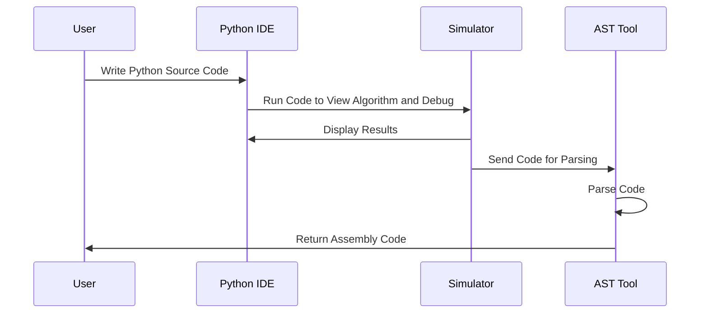

```mermaid
sequenceDiagram
participant User as User
participant PythonIDE as Python IDE
participant Simulator as Simulator
participant ASTTool as AST Tool

    User ->> PythonIDE: Write Python Source Code
    PythonIDE ->> Simulator: Run Code to View Algorithm and Debug
    Simulator ->> PythonIDE: Display Results
    Simulator ->> ASTTool: Send Code for Parsing
    ASTTool ->> ASTTool: Parse Code

    ASTTool ->> User: Return Assembly Code
```
